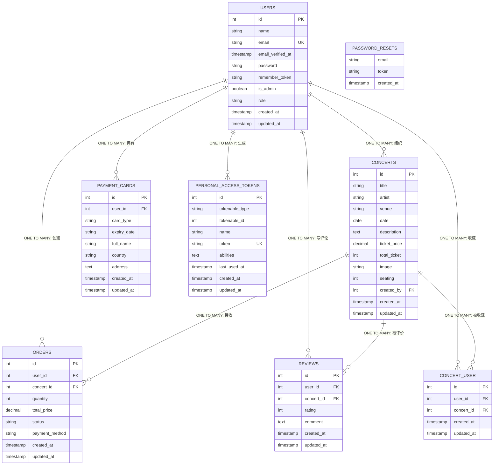

# Concert System - 完整数据库ERD图

## Mermaid ERD 代码

## 关系类型说明

### Mermaid ERD 关系符号
- `||` = ONE (一个)
- `o{` = MANY (多个)
- `||--o{` = **ONE TO MANY** (一对多)

### 系统中的所有关系

| 从表 | 到表 | 关系类型 | 外键 | 说明 |
|------|------|---------|------|------|
| USERS | ORDERS | **ONE TO MANY** | user_id | 一个用户可以创建多个订单 |
| USERS | REVIEWS | **ONE TO MANY** | user_id | 一个用户可以写多个评论 |
| USERS | CONCERT_USER | **ONE TO MANY** | user_id | 一个用户可以收藏多个音乐会 |
| USERS | CONCERTS | **ONE TO MANY** | created_by | 一个用户可以组织多个音乐会 |
| USERS | PAYMENT_CARDS | **ONE TO MANY** | user_id | 一个用户可以拥有多张支付卡 |
| USERS | PERSONAL_ACCESS_TOKENS | **ONE TO MANY** | tokenable_id | 一个用户可以生成多个API令牌 |
| CONCERTS | ORDERS | **ONE TO MANY** | concert_id | 一个音乐会可以被多个用户订购 |
| CONCERTS | REVIEWS | **ONE TO MANY** | concert_id | 一个音乐会可以收到多个评论 |
| CONCERTS | CONCERT_USER | **ONE TO MANY** | concert_id | 一个音乐会可以被多个用户收藏 |

## 多对多关系

**USERS ↔ CONCERTS** (通过 CONCERT_USER 关联表)
- 一个用户可以收藏多个音乐会
- 一个音乐会可以被多个用户收藏
- 联接表确保每个用户只能收藏同一音乐会一次 (`UNIQUE [user_id, concert_id]`)

## 表结构总结

- **USERS**: 8个字段（id, name, email, password, is_admin, role, timestamps）
- **CONCERTS**: 11个字段（id, title, artist, venue, date, description, ticket_price, total_ticket, image, seating, created_by, timestamps）
- **ORDERS**: 8个字段（id, user_id, concert_id, quantity, total_price, status, payment_method, timestamps）
- **REVIEWS**: 6个字段（id, user_id, concert_id, rating, comment, timestamps）
- **CONCERT_USER**: 5个字段（id, user_id, concert_id, timestamps + unique constraint）
- **PAYMENT_CARDS**: 10个字段（id, user_id, card_type, card_number, expiry_date, cvv, full_name, country, address, timestamps）
- **PASSWORD_RESETS**: 3个字段（email, token, created_at）
- **PERSONAL_ACCESS_TOKENS**: 7个字段（id, tokenable_type, tokenable_id, name, token, abilities, timestamps）
